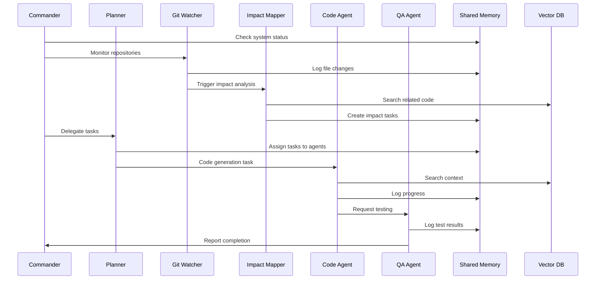

# Design Document

## Overview

DevGuard is an autonomous multi-agent developer swarm system that leverages LangGraph for orchestration, ChromaDB for knowledge storage, and local/cloud LLM integration for intelligent code maintenance. The system operates as a coordinated swarm of 10 specialized agents that continuously monitor, analyze, and enhance codebases across multiple Git repositories while maintaining complete audit trails and providing MCP server capabilities for IDE integration.

The architecture follows a distributed agent pattern where each agent has specific responsibilities but shares knowledge through a unified memory system. The system prioritizes local-first operation with cloud fallback, ensuring privacy while maintaining functionality.

## Architecture

### High-Level Architecture

```mermaid
graph TB
    subgraph "External Interfaces"
        CLI[CLI Interface]
        MCP[MCP Server]
        IDE[IDE Integration]
        NOTIF[Notifications]
    end
    
    subgraph "LangGraph Orchestration Layer"
        GRAPH[LangGraph State Machine]
        ROUTER[Conditional Routing]
        CHECKPT[State Checkpointing]
    end
    
    subgraph "Agent Swarm"
        CMD[Commander Agent]
        PLAN[Planner Agent]
        CODE[Code Agent]
        QA[QA/Test Agent]
        DOCS[Docs Agent]
        GIT[Git Watcher Agent]
        IMPACT[Impact Mapper Agent]
        AUDIT[Repo Auditor Agent]
        DEP[Dep Manager Agent]
        RED[Red Team Agent]
    end
    
    subgraph "Shared Knowledge Layer"
        MEMORY[(Shared Memory SQLite)]
        VECTOR[(Vector DB ChromaDB)]
        CONFIG[Configuration]
    end
    
    subgraph "External Services"
        GOOSE[Goose CLI]
        OLLAMA[Ollama Local LLM]
        CLOUD[Cloud LLMs]
        REPOS[Git Repositories]
    end
    
    CLI --> GRAPH
    MCP --> MEMORY
    MCP --> VECTOR
    IDE --> MCP
    
    GRAPH --> CMD
    GRAPH --> PLAN
    GRAPH --> CODE
    GRAPH --> QA
    GRAPH --> DOCS
    GRAPH --> GIT
    GRAPH --> IMPACT
    GRAPH --> AUDIT
    GRAPH --> DEP
    GRAPH --> RED
    
    CMD --> MEMORY
    PLAN --> MEMORY
    CODE --> MEMORY
    QA --> MEMORY
    DOCS --> MEMORY
    GIT --> MEMORY
    IMPACT --> MEMORY
    AUDIT --> MEMORY
    DEP --> MEMORY
    RED --> MEMORY
    
    CMD --> VECTOR
    PLAN --> VECTOR
    CODE --> VECTOR
    QA --> VECTOR
    DOCS --> VECTOR
    GIT --> VECTOR
    IMPACT --> VECTOR
    AUDIT --> VECTOR
    DEP --> VECTOR
    RED --> VECTOR
    
    CODE --> GOOSE
    CODE --> OLLAMA
    CODE --> CLOUD
    
    GIT --> REPOS
    AUDIT --> REPOS
    
    CMD --> NOTIF
```



### Agent Communication Flow



## Components and Interfaces

### Core Components

#### 1. LangGraph Orchestration Engine

**Purpose**: Coordinates agent execution using state machines and conditional routing.

**Key Classes**:
- `DevGuardSwarm`: Main orchestrator class
- `SwarmState`: Shared state model across all agents
- `SqliteSaver`: State persistence for checkpointing

**Interfaces**:
```python
class DevGuardSwarm:
    async def start() -> None
    async def stop() -> None
    def create_task(description: str, task_type: str, agent_id: str) -> str
    def get_status() -> Dict[str, Any]
```

#### 2. Shared Memory System

**Purpose**: Provides centralized memory for agent coordination and audit trails.

**Key Classes**:
- `SharedMemory`: Main memory interface
- `MemoryEntry`: Individual memory records
- `TaskStatus`: Task tracking and status
- `AgentState`: Agent status monitoring

**Interfaces**:
```python
class SharedMemory:
    def add_memory(entry: MemoryEntry) -> str
    def get_memories(agent_id: str, memory_type: str) -> List[MemoryEntry]
    def create_task(task: TaskStatus) -> str
    def update_task(task_id: str, **updates) -> bool
    def update_agent_state(state: AgentState) -> None
```

#### 3. Vector Database System

**Purpose**: Stores and retrieves code knowledge using semantic search.

**Key Classes**:
- `VectorDatabase`: Main vector DB interface
- `Document`: Document model for storage
- `VectorDBConfig`: Configuration for vector operations

**Interfaces**:
```python
class VectorDatabase:
    def add_file_content(file_path: Path, content: str, metadata: Dict) -> List[str]
    def search(query: str, n_results: int, where: Dict) -> List[Dict]
    def search_code(query: str, file_extensions: List[str]) -> List[Dict]
    def update_file_content(file_path: Path, content: str) -> List[str]
```

#### 4. Configuration Management

**Purpose**: Manages system configuration with environment variable overrides.

**Key Classes**:
- `Config`: Main configuration class
- `LLMConfig`: LLM provider settings
- `AgentConfig`: Per-agent configuration
- `RepositoryConfig`: Repository monitoring settings

### Agent Components

#### 1. Base Agent Framework

**Purpose**: Provides common functionality for all specialized agents.

**Key Features**:
- Retry logic with exponential backoff
- Heartbeat monitoring
- Memory logging (observations, decisions, results)
- Command execution with timeout
- Knowledge search capabilities

**Interface**:
```python
class BaseAgent(ABC):
    @abstractmethod
    async def execute(state: Any) -> Any
    def log_observation(observation: str, data: Dict) -> str
    def log_decision(decision: str, reasoning: str) -> str
    def log_result(result: str, data: Dict) -> str
    def search_knowledge(query: str) -> List[Dict]
    def create_task(description: str, task_type: str) -> str
```

#### 2. Commander Agent

**Purpose**: System oversight, user communication, and swarm coordination.

**Key Responsibilities**:
- Health monitoring of all agents
- User request handling and task delegation
- System status reporting
- Critical error escalation
- Notification management

**Decision Logic**:
- Priority 1: Investigate failed tasks
- Priority 2: Delegate pending tasks to planner
- Priority 3: Audit repositories if vector DB is sparse
- Priority 4: Analyze performance if success rate < 80%
- Default: Monitor repositories for changes

#### 3. Planner Agent

**Purpose**: Task breakdown, prioritization, and agent assignment.

**Key Responsibilities**:
- Parse complex tasks into subtasks
- Assign tasks to appropriate agents
- Manage task dependencies
- Load balancing across agents
- Task queue optimization

**Task Routing Map**:
- `code_generation`, `code_refactor` → Code Agent
- `documentation` → Docs Agent  
- `testing` → QA/Test Agent
- `impact_analysis` → Impact Mapper Agent
- `dependency_update` → Dependency Manager Agent
- `security_scan`, `vulnerability_assessment`, `penetration_test` → Red Team Agent

#### 4. Code Agent

**Purpose**: Code generation, refactoring, and modification using Goose CLI.

**Key Responsibilities**:
- Execute Goose CLI commands for code generation
- Apply code patches and refactoring
- Handle code formatting and style
- Integrate with local/cloud LLMs
- Error handling and retry logic

**Integration Points**:
- Goose CLI for code execution
- Vector DB for context retrieval
- QA Agent for testing validation

#### 5. QA/Test Agent

**Purpose**: Automated testing, linting, and quality assurance.

**Key Responsibilities**:
- Run pytest for unit/integration tests
- Execute linting (ruff) and formatting (black)
- Type checking with mypy
- Test result analysis and reporting
- Automatic retry on failures

**Quality Gates**:
- All tests must pass before code acceptance
- Linting errors must be resolved
- Type checking must pass
- Code coverage thresholds must be met

#### 6. Docs Agent

**Purpose**: Documentation generation and maintenance.

**Key Responsibilities**:
- Update docstrings based on code changes
- Maintain README and documentation files
- Generate API documentation
- Sync documentation with code modifications
- Markdown formatting and validation

#### 7. Git Watcher Agent

**Purpose**: Repository monitoring and change detection.

**Key Responsibilities**:
- Monitor file system changes using watchdog
- Track Git commits and branch updates
- Log change metadata to shared memory
- Trigger downstream analysis tasks
- Handle multiple repository monitoring

**Monitoring Capabilities**:
- Real-time file change detection
- Git hook integration
- Branch and tag monitoring
- Commit message analysis
- Diff generation and storage

#### 8. Impact Mapper Agent

**Purpose**: Cross-repository impact analysis and dependency tracking.

**Key Responsibilities**:
- Analyze code changes for cross-repo impacts
- Identify breaking changes and dependencies
- Generate tasks for affected repositories
- Maintain dependency graphs
- API compatibility checking

**Analysis Techniques**:
- Static code analysis
- Import/export tracking
- API signature comparison
- Semantic versioning analysis
- Dependency graph traversal

#### 9. Repo Auditor Agent

**Purpose**: Repository scanning and knowledge base maintenance.

**Key Responsibilities**:
- Scan repositories for new/modified files
- Ingest content into vector database
- Identify missing important files
- Maintain file metadata and indexing
- Cleanup stale vector entries

**Scanning Patterns**:
- Configurable file type inclusion/exclusion
- Intelligent content chunking
- Metadata extraction and tagging
- Duplicate detection and handling
- Incremental updates

#### 10. Dependency Manager Agent

**Purpose**: Dependency tracking, updates, and compatibility management.

**Key Responsibilities**:
- Monitor dependency versions across repositories
- Automated dependency updates
- Compatibility testing and validation
- Security vulnerability scanning
- Update justification logging

**Update Strategies**:
- Semantic versioning compliance
- Automated testing before updates
- Rollback capabilities
- Security patch prioritization
- Breaking change detection

#### 11. Red Team Agent

**Purpose**: Security testing, vulnerability assessment, and penetration testing.

**Key Responsibilities**:
- Automated security vulnerability scanning
- OWASP Top 10 and CWE pattern detection
- Dependency security analysis
- Penetration testing against configured endpoints
- Security policy compliance validation
- Critical vulnerability escalation

**Security Testing Capabilities**:
- Static Application Security Testing (SAST)
- Dynamic Application Security Testing (DAST)
- Software Composition Analysis (SCA)
- Infrastructure security scanning
- API security testing
- Authentication and authorization testing

**Integration Points**:
- Security scanning tools (bandit, safety, semgrep)
- Vulnerability databases (CVE, NVD)
- Penetration testing frameworks
- Security policy engines
- Notification systems for critical findings

### MCP Server Integration

#### MCP Server Component

**Purpose**: Expose DevGuard knowledge and capabilities to IDEs and external tools.

**Key Features**:
- Model Context Protocol compliance
- Real-time knowledge access
- Code analysis and recommendations
- Cross-repository context provision
- Standards and pattern guidance

**MCP Tools Exposed**:
```python
# Knowledge retrieval tools
get_code_context(file_path: str, query: str) -> Dict
search_patterns(pattern_type: str, language: str) -> List[Dict]
get_dependencies(repo_path: str) -> Dict
analyze_impact(change_description: str) -> Dict

# Recommendation tools
suggest_improvements(code_snippet: str) -> List[Dict]
check_standards(file_path: str) -> Dict
get_related_code(current_file: str) -> List[Dict]
validate_architecture(component_description: str) -> Dict

# Security tools
scan_vulnerabilities(file_path: str) -> Dict
check_security_compliance(repo_path: str) -> Dict
assess_risk_level(change_description: str) -> Dict
get_security_recommendations(vulnerability_type: str) -> List[Dict]
```

**Integration Points**:
- Direct access to Vector Database for semantic search
- Shared Memory queries for recent decisions and patterns
- Real-time agent status and recommendations
- Configuration-based response customization

## Data Models

### Core Data Models

#### Memory Entry Model
```python
class MemoryEntry(BaseModel):
    id: str
    agent_id: str
    timestamp: datetime
    type: str  # task, observation, decision, result, error
    content: Dict[str, Any]
    tags: Set[str]
    parent_id: Optional[str]
    context: Dict[str, Any]
```

#### Task Status Model
```python
class TaskStatus(BaseModel):
    id: str
    agent_id: str
    status: str  # pending, running, completed, failed, cancelled
    description: str
    created_at: datetime
    updated_at: datetime
    metadata: Dict[str, Any]
    dependencies: List[str]
    result: Optional[Dict[str, Any]]
    error: Optional[str]
```

#### Agent State Model
```python
class AgentState(BaseModel):
    agent_id: str
    status: str  # idle, busy, error, stopped
    current_task: Optional[str]
    last_heartbeat: datetime
    metadata: Dict[str, Any]
```

#### Document Model
```python
class Document(BaseModel):
    id: str
    content: str
    metadata: Dict[str, Any]
    source: str
    chunk_index: int
```

### Configuration Models

#### Repository Configuration
```python
class RepositoryConfig(BaseModel):
    path: str
    branch: str = "main"
    auto_commit: bool = False
    auto_push: bool = False
    ignore_patterns: List[str]
    watch_files: List[str]
```

#### LLM Configuration
```python
class LLMConfig(BaseModel):
    provider: str = "ollama"
    model: str = "qwen/qwen3-235b-a22b:free"
    api_key: Optional[str]
    base_url: Optional[str]
    temperature: float = 0.1
    max_tokens: int = 4096
    fallback_provider: Optional[str]
    fallback_model: Optional[str]
```

## Error Handling

### Error Categories

1. **Agent Execution Errors**
   - Timeout errors with configurable retry
   - LLM API failures with fallback mechanisms
   - File system access errors with permission handling
   - Network connectivity issues with offline mode

2. **Data Persistence Errors**
   - Database connection failures with retry logic
   - Vector database corruption with rebuild capabilities
   - Memory overflow with cleanup mechanisms
   - Disk space issues with archival strategies

3. **Integration Errors**
   - Goose CLI execution failures with alternative approaches
   - Git operation failures with conflict resolution
   - External API rate limiting with backoff strategies
   - Configuration validation errors with defaults

### Error Recovery Strategies

1. **Graceful Degradation**
   - Continue operation with reduced functionality
   - Fallback to alternative approaches
   - Maintain core monitoring capabilities
   - Preserve audit trail integrity

2. **Automatic Recovery**
   - Exponential backoff for transient failures
   - Agent restart mechanisms for persistent errors
   - Database repair and optimization routines
   - Configuration validation and correction

3. **User Notification**
   - Critical error escalation to configured channels
   - Detailed error context and suggested actions
   - Recovery progress reporting
   - Manual intervention request mechanisms

## Testing Strategy

### Unit Testing Approach

1. **Agent Testing**
   - Mock shared memory and vector DB dependencies
   - Test individual agent decision logic
   - Validate error handling and retry mechanisms
   - Test configuration loading and validation

2. **Component Testing**
   - Test shared memory operations with in-memory SQLite
   - Test vector database operations with test collections
   - Test LangGraph state transitions and routing
   - Test configuration management and overrides

3. **Integration Testing**
   - Test agent communication through shared memory
   - Test end-to-end task execution workflows
   - Test MCP server integration with mock clients
   - Test repository monitoring and change detection

### Test-Driven Development

1. **Function-Level TDD**
   - Write tests before implementing functions
   - Ensure 100% test coverage for critical paths
   - Use pytest fixtures for consistent test setup
   - Implement property-based testing for complex logic

2. **Agent-Level TDD**
   - Define agent behavior through tests
   - Test agent state transitions and decision points
   - Validate agent memory logging and retrieval
   - Test agent error handling and recovery

3. **System-Level TDD**
   - Define system behavior through integration tests
   - Test swarm coordination and task distribution
   - Validate cross-repository impact analysis
   - Test MCP server functionality and responses

### Quality Assurance Pipeline

1. **Pre-commit Hooks**
   - Black code formatting
   - isort import sorting
   - Ruff linting with strict rules
   - Mypy type checking with strict mode

2. **Continuous Integration**
   - Automated test execution on all changes
   - Code coverage reporting with minimum thresholds
   - Performance regression testing
   - Security vulnerability scanning

3. **Quality Gates**
   - All tests must pass before merge
   - Code coverage must be ≥95%
   - No linting or type checking errors
   - Documentation must be updated for API changes

### Testing Infrastructure

1. **Test Data Management**
   - Synthetic repository generation for testing
   - Mock LLM responses for consistent testing
   - Test configuration profiles for different scenarios
   - Cleanup mechanisms for test isolation

2. **Performance Testing**
   - Load testing for concurrent agent operations
   - Memory usage monitoring and leak detection
   - Vector database performance benchmarking
   - Response time validation for MCP operations

3. **End-to-End Testing**
   - Full workflow testing with real repositories
   - Integration testing with actual IDEs
   - Notification system testing with real endpoints
   - Disaster recovery and data corruption testing